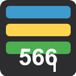

# Code566

<p align="center">
  
</p>

<div align="center">
  <a href="https://marketplace.visualstudio.com/items?itemName=aliv029bmj.code566">
    
  </a>
  <a href="https://github.com/aliv029bmj/codemate/blob/main/LICENSE">
    
  </a>
  <a href="https://github.com/aliv029bmj/codemate">
    
  </a>
</div>

## Overview

**Code566** transforms your VS Code line/column indicator into a fun, interactive experience with selectable user modes. Make your coding sessions more engaging and enjoyable!

## Features

Code566 enhances your coding experience by replacing the standard line/column display with one of seven interactive modes:

1. **Pixel Pet Mode** - A virtual pet that reacts to your coding behavior, gaining experience and energy based on your typing patterns.

2. **Travel Mode** - Virtually travel to different cities around the world based on your cursor position, with distance tracking and city information.

3. **Stats HUD Mode** - Displays a comprehensive dashboard of coding statistics including typing speed, character count, and line information.

4. **Heat Map Mode** - Visualizes your editing activity with a color-coded heat map, showing which parts of your code receive the most attention.

5. **Line Length Warning Mode** - Highlights lines that exceed recommended length limits, with customizable settings for different programming languages.

6. **Code Feature Detector Mode** - Detects and displays information about code structures at your cursor position, providing insights into your codebase.

7. **Line/Column Records Mode** - Tracks and displays interesting statistics and records about your line and column positions across your coding sessions.

## Screenshots

### Heat Map Mode

Heat Map mode shows which parts of your code you edit most frequently, with a color gradient from green (low activity) to red (high activity).

### Line Length Warning Mode

This mode highlights lines that exceed recommended length, with different warning levels and language-specific configurations.

### Code Feature Detector Mode

Detects and displays detailed information about code structures like functions, classes, and variables at your cursor position.

### Line/Column Records Mode

Tracks your coding records like highest line number, rightmost column, longest line, and more across your coding sessions.

## Installation

### Quick Install (Recommended)

#### For Linux/macOS users:

```bash
# Make the script executable
chmod +x ./scripts/install.sh

# Run the installation script
./scripts/install.sh
```

#### For Windows users:

```powershell
# Run the PowerShell installation script
.\scripts\install.ps1
```

### Via VS Code Marketplace

1. Open VS Code
2. Click the Extensions view icon in the Sidebar or press `Ctrl+Shift+X`
3. Search for "Code566"
4. Click Install

### Manual Installation

```bash
# Install from the VSIX file
code --install-extension code566-0.2.0.vsix
```

For detailed installation instructions, see [INSTALL.md](INSTALL.md).

## Usage

After installation, Code566 starts with no mode selected by default. To start using the extension:

1. Click on the "Code566" button in the status bar, or
2. Open the Command Palette (`Ctrl+Shift+P` or `F1`)
3. Type "Code566: Select Mode" and press Enter
4. Choose your preferred mode from the list

Only one mode can be active at a time. You can switch between modes or disable all modes through the same command.

Each mode has its own unique commands and features:

- **Pixel Pet Mode**: Watch your virtual pet grow as you code
- **Travel Mode**: Explore different cities without leaving your editor
- **Stats HUD Mode**: Toggle the stats dashboard with "Code566: Toggle Stats HUD"
- **Heat Map Mode**: Visualize your code activity with "Code566: Toggle Heat Map"
- **Line Length Warning Mode**: Configure line length settings with "Code566: Configure Line Length Settings"
- **Code Feature Detector Mode**: View code structure information with "Code566: Toggle Code Feature Detector"
- **Line/Column Records Mode**: Track your coding records with "Code566: Show Line/Column Records"

## Configuration

You can configure Code566 through VS Code settings:

1. Open VS Code settings (`Ctrl+,`)
2. Search for "Code566"
3. Adjust settings according to your preferences

The `code566.activeMode` setting will reflect your current mode choice, but it's recommended to use the Command Palette or status bar to change modes.

## Contributing

Contributions are welcome! Feel free to submit issues or pull requests to the [GitHub repository](https://github.com/aliv029bmj/codemate).

## License

This project is licensed under the MIT License - see the LICENSE file for details.
